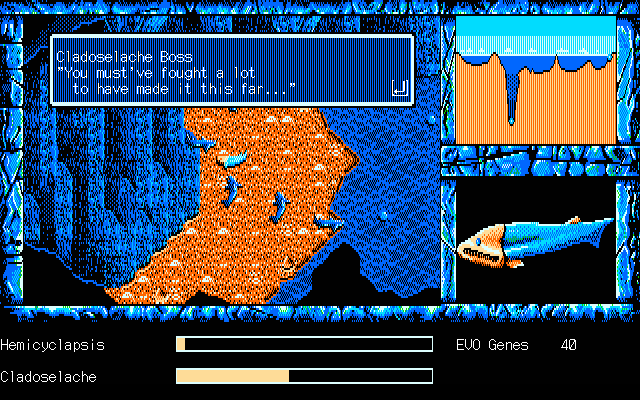

# shank-a-rom

Romhacking utilities and notes developed as part of the English translation patch for *46 Okunen Monogatari: The Shinkaron* / *E.V.O.: The Theory of Evolution* (PC-98).

The game this patch targets is the Japanese-only prequel to the cult classic action RPG *46 Okunen Monogatari: Harukanaru Eden e* / *E.V.O.: Search for Eden* (SNES). See [Hardcore Gaming 101](http://www.hardcoregaming101.net/46okunen/46okunen.htm) for information on both games.

### Progress
| Segment      | %    | Strings      | Typeset? | Script Version |
| -------------|-----:|:------------:|:--------:|:--------------:|
| Opening      |100%  |  (42 / 42)   | Yes      | Beta           |
| Chapter 1    |100%  | (500 / 500)  | Yes      | Beta           |
| Chapter 2    |100%  | (434 / 434)  | Yes      | Beta           |
| Chapter 3    |100%  | (338 / 338)  | Yes      | Beta           |
| Chapter 4    |100%  | (747 / 747)  | Yes      | Beta           |
| Chapter 5    |100%  | (892 / 892)  | Yes      | Beta           |
| Chapter 6    |100%  | (319 / 319)  | Yes      | Beta           |
| Ending       |100%  |  (70 / 70)   | Yes      | Beta           |
| System       |100%  |   (5 / 5)    | Yes      | Beta           |
| Images       |100%  |   (9 / 9)    |          | Beta           |
| Encyclopedia |100%  | (935 / 935)  | Yes      | Beta           |
| Game Overs   |100%  | (729 / 729)  | Mostly   | Beta           |
| Total        |100%  |(5057 / 5057) |          |                |

It's harder to quanitify the status of the project for things like bugfixes, typesetting, etc. Progress is definitely being made, however, even if the percents aren't going up much.

For more details on the state of the project, [here is the current TODO list](../master/todo.md).

### How do I use this?
* Wait for it to be released!
* The patch will target these disk images:
	* FDI
		* 46 Okunen Monogatari - The Sinkaron (J) A user.FDI `md5: CA56B37F74885C40EDC9B1D2AACB5DA6`
		* 46 Okunen Monogatari - The Sinkaron (J) B 2.FDI `md5: 3C1C0FBE1CF0A4C1B4574FFC26A490AB`
		* 46 Okunen Monogatari - The Sinkaron (J) B 3.FDI `md5: A3934EED652627ABB45A756F13EC531A`
		* 46 Okunen Monogatari - The Sinkaron (J) B 4.FDI `md5: 60E4D019F0CEF79C3D2EA3D44E6BF70E`
	* HDI
		* 46 Okunen Monogatari - The Shinkaron.hdi `md5: F71C6DFD13A51E56BEA63A81CE735C26'
	* HDI (Tokugawa hardware hack, maybe this won't be supported??)
		* 46okunenm.hdi `md5: 2B00A01944048980647FCE7ADEF07F57'
	* HDM
		* 46 Okunen Monogatari - The Shinkaron (Disk 1 - User disk).hdm `md5: DB9AC9FB330B527C27CBA425E9BD25A2`
		* 46 Okunen Monogatari - The Shinkaron (Disk 2).hdm `md5: E68A1117B54A626760BE420DA7BF67CD`
		* 46 Okunen Monogatari - The Shinkaron (Disk 3).hdm `md5: A7E8022404E2A34EA0491C8AA8E9D37E`
		* 46 Okunen Monogatari - The Shinkaron (Disk 4).hdm `md5: DB5C8B6096A78B513313E8120AF22C68`
	* (Not supporting HDM [Alt 1], which is missing a disk anyway).

	
* If you want to use any of the utilities for yourself, I didn't really plan for that. I can't distribute the game data or the master translation spreadhseet.
	* Feel free to read the documents, however.